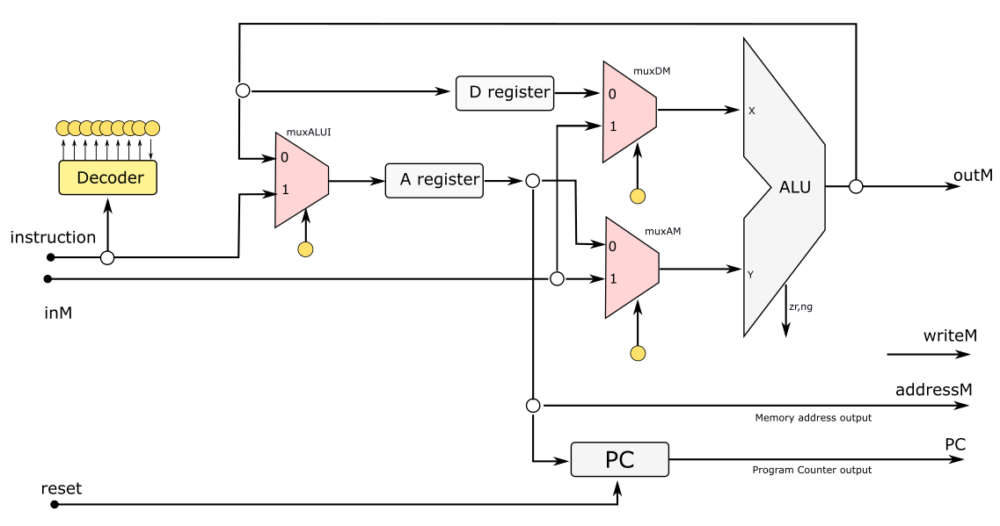

# Av4 - 1° Semestre de 2022


Avaliação 4 - Elementos de Sistemas

| Pontos HW | Pontos SW |
|:---------:|:---------:|
| 10        | 45        |

- Avaliação **individual**.
- **120 min** total.
- Ficar no blackboard durante a prova.
- Clonar o seu repositório (e trabalhar nele)
- Fazer **commit** ao final de cada questão.
- Lembre de dar **push** ao final.


**LEMBRE DE REALIZAR UM COMMIT (A CADA QUESTÃO) E DAR PUSH AO FINALIZAR**


## 1. Add32 - O retorno


| Pontos HW | Pontos SW |
|:---------:|:---------:|
| 10        | 15        |

Assim como na Av3, queremos realizar uma operação matemática da soma de dois núemros de 32 bits.

Considere que os 16 bits menos significativos de um número W estejam armazenados na 'temp 0' e os 16 bits mais significativos estejam armazenados na 'temp 1'. Considere também que os 16 bits menos significativos de um número T estejam armazenados na 'temp 2' e os 16 bits mais significativos estejam armazenados na 'temp 3'. 

Crie uma função em linguagem de máquina que **detecta** o vaium da soma dos 16 bits menos significativos.

Implemente a soma de 32 bits no arquivo main, considerando o vaium, e salvo os 16 bits menos significativos do na 'temp 4' e os 16 bits mais significativos na 'temp 5'.


#### Exemplo:

W = "00110011001100110000111100001111"

T  = "00001111000011110011001100110011"

Representação na memória:

temp 0 = "0000111100001111"

temp 1 = "0011001100110011"

temp 2 = "0011001100110011"

temp 3 = "0000111100001111"

Resultado:

W+T = "01000010010000100100001001000010"

temp 4 = '0100001001000010'

temp 5 = '0100001001000010'

### Lembrando:

O vaium irá ocorrer quando:

 - (RAM[5][15] = 1 E RAM[7][15] = 1) OU 
 - (RAM[5][15] = 1 E RAM[7][15] = 0 E RAM[9][15] = 0) OU
 - (RAM[5][15] = 0 E RAM[7][15] = 1 E RAM[9][15] = 0) 

## Pontuação HW

Considerando RAM[5][15], RAM[7][15] e RAM[9][15] como as variáveis booleanas A, B e C, escreve e minimize a expressão lógica para o vaium.

### Resposta

Responda e justifique os passos no arquivo `vm/booleana.txt`.


## Pontuação SW

### Implementação

Implemente a programação nos arquivos `vm/add32/Main.vm` e `vm/add32/vaium.vm`.

### Testes

Execute o script

```
./testeVm.py
```

#### Rubrica para avaliação:

| Pontos HW | Pontos SW | Descritivo                                                                  |
|-----------|-----------|-----------------------------------------------------------------------------|
| 10        |           | Simplificação da função lógica                                              |
|           | 10        | Implementação da função vaium                                               |
|           | 5         | Implementação da soma no arquivo main incluindo a chamada para função vaium |

## 2. Assembler - instrução modificada


| Pontos HW | Pontos SW |
|:---------:|:---------:|
| 0         | 15        |

Na Av3, foi proposta uma modificação na CPU de forma a incluir o muxDM como indicado na figura, permitindo que os dados da memória também possam entrar em X, o que permitiria que operações como  addw (%A), (%A), %D pudessem ser realizadas. 



Dessa forma, o formato das instruções, que permanece usando 18 bits, deve ser alterado da seguinte forma:

- na instrução tipo C, o bit 14 (que era mantido em zero no CPU original) passa a representar o sinal de controle do muxDM.
- as instruções tipo A não são alteradas.


### Implementação

Implemente apenas o **comp()** no arquivo **Code.java** para uma instrução addw, considerando todas as possíveis combinações que podem ocorrer na CPU modificada.

### Testes

O teste deve ser executado dentro do IntelliJ através do arquivo **CodeTest.java**.


#### Rubrica para avaliação:

| Pontos SW | Descritivo                                                            |
|-----------|-----------------------------------------------------------------------|
| 15        | Função implementada e passando nos testes                             |
| ?         | Implementações incompletas ou incorretas serão analisadas caso a caso |


## 3. VMTranslator - swap


| Pontos HW | Pontos SW |
|:---------:|:---------:|
| 0         | 15        |

Queremos agora incluir um novo comando em linguagem de máquina (swap) que inverte as posições dos dois últimos elementos da pilha.


### Implementação

Implemente a tradução do swap no arquivo Code.java no projeto VMTranslator localizado em `VMTranslator/src/main/java/vmtraslator`.

### Testes

Execute o script

```
./testeVMtranslator.py
```

#### Rubrica para avaliação:

| Pontos SW | Descritivo                                                            |
|-----------|-----------------------------------------------------------------------|
| 15        | Função implementada e passando nos testes                             |
| ?         | Implementações incompletas ou incorretas serão analisadas caso a caso |

